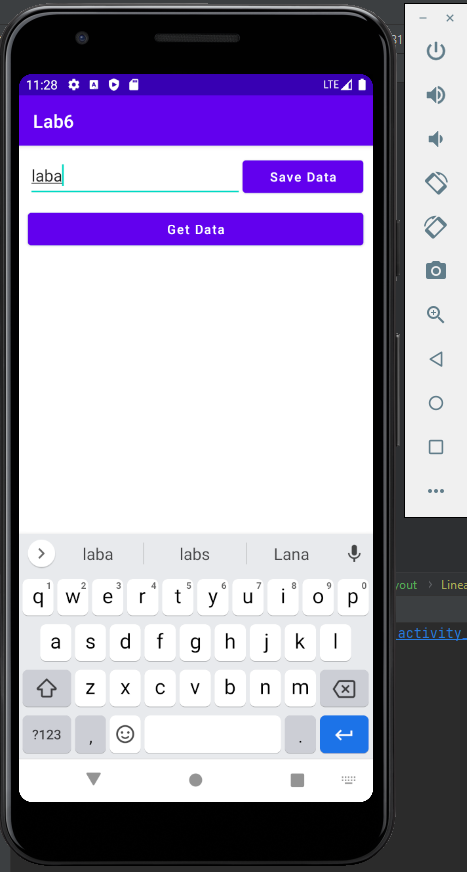

# Васильев Никита 803в2
1. Добавим следующий код:  

4. Проверим работоспособность. Так как при повороте Activity уничтожается и заново создаётся, проверим сохранение данных поворотом телефона.
Запустил с эмулятора, не было возможности запустить с устройства.
  

  

